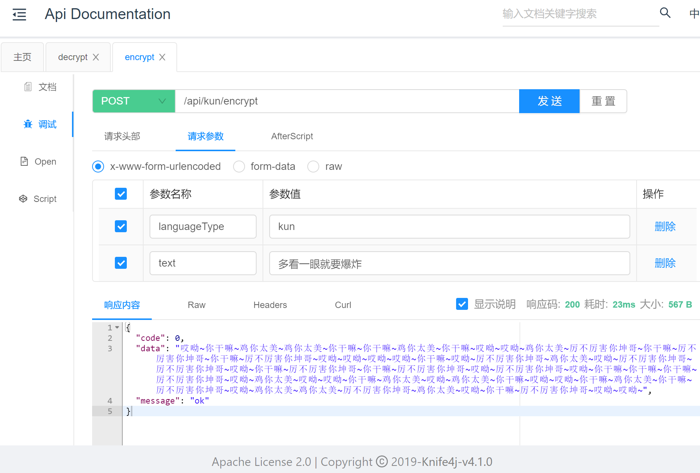
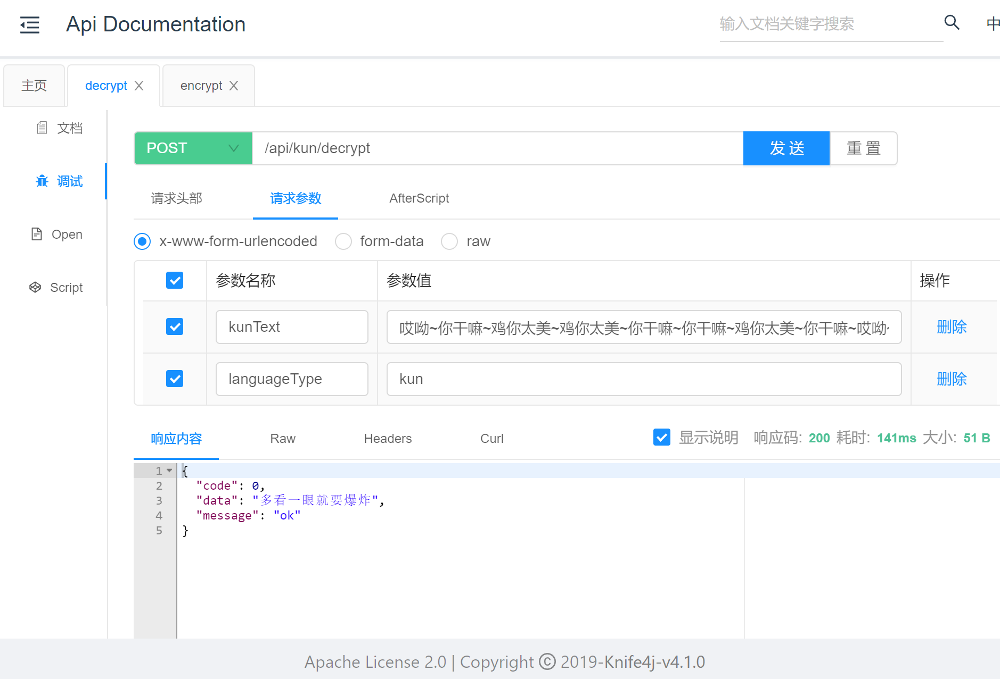

# KunKun-Translator
坤言乱语，说话我只说坤语。

## TODO

- [x] 后端坤语加密算法
- [x] 后端坤语解密算法
- [ ] 前端页面开发

## 技术选型

### 前端

- Ant Deigin Pro
- React

### 后端

- Spring Boot
- Spring MVC
- Swagger / Knife4j

## 系统机构图

### 前端

### 后端算法

## 效果展示

### 翻译为坤语

### 坤语解密

## 当前支持语言类型

> 如果需要定制化需求，可以在model.enums里面修改，添加自己的语料库。

- 坤语`kun`
- 小鬼语`ghost`

## 如何访问

前端暂未开发，可以将项目跑起来，查看`http://localhost:8080/api/doc.html`文档进行在线调试。
